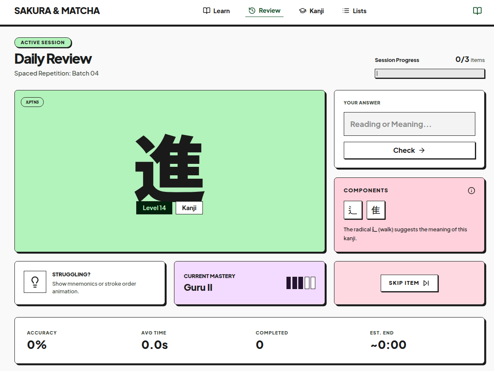
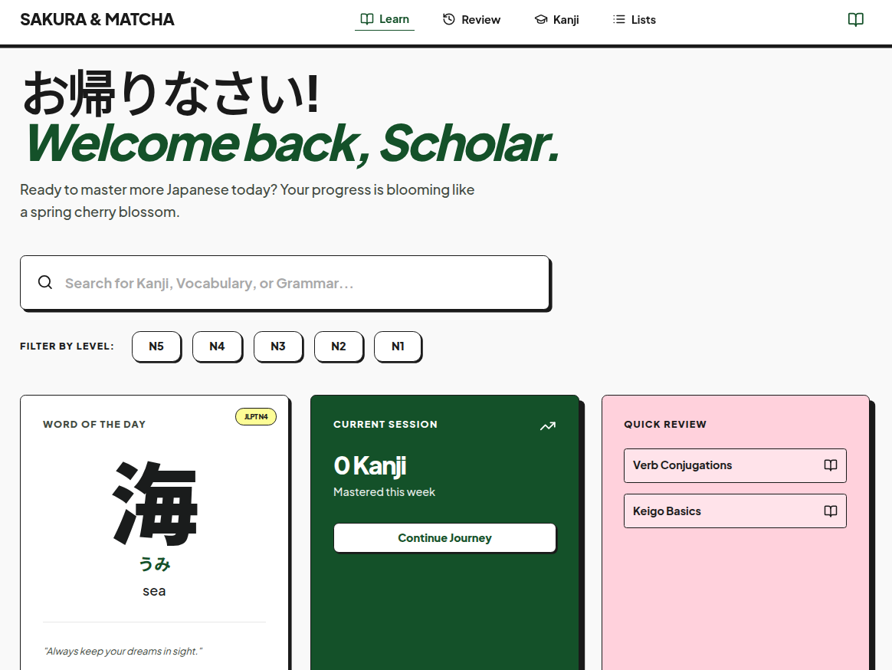

# Komorebi

> **Japanese Learning Platform with Neo-Brutalist Design**

A modern, high-performance Japanese learning application featuring kanji exploration, study lists, and progress tracking. Built with React 19, TypeScript, and Tailwind CSS 4.

[](https://opensource.org/licenses/MIT)
[](https://reactjs.org/)
[](https://www.typescriptlang.org/)

🔗 **[Live Demo](https://komorebi--raihanwest.replit.app/)**

---

## 📸 Screenshots





---

## 🛠️ Tech Stack

| Category | Technology |
|----------|------------|
| **Framework** | React 19 |
| **Language** | TypeScript 5.6 |
| **Routing** | React Router v7 |
| **State Management** | Zustand (client) + TanStack Query v5 (server) |
| **Styling** | Tailwind CSS 4 |
| **Animations** | Motion (Framer Motion) |
| **Icons** | Lucide React |
| **Build Tool** | Vite 6 |
| **Deployment** | Vercel |

> **Note:** This is a frontend-only prototype with mock data. All data is stored locally - no backend or API connection required.

---

## ✨ Key Features

### 🎨 User Experience
- **Neo-Brutalist Design** - Bold colors, hard shadows, and geometric shapes
- **Responsive Layout** - Mobile-first design with bottom nav (mobile) and top nav (desktop)
- **Smooth Animations** - GPU-accelerated transitions powered by Motion
- **Dark Theme Ready** - Built with Tailwind CSS custom properties for easy theming

### 📄 Pages
- **Dashboard (Learn)** - Bento grid overview with Word of the Day, session stats, and quick actions
- **Kanji Explorer** - Browse kanji by JLPT level (N5-N1) with detailed information
- **Study Lists** - Manage your personal study collections
- **Review** - Spaced repetition review system
- **Profile** - User progress and statistics

### ⚡ Technical
- **Service Layer Architecture** - Clean API abstraction with HTTP client
- **Error Handling** - Comprehensive error management with boundaries and custom error classes
- **Type Safety** - Full TypeScript coverage with strict mode
- **React Query Integration** - Optimized data fetching, caching, and background updates
- **Configuration System** - Centralized config with environment variables and constants
- **State Management** - Zustand for client state, TanStack Query for server state

### 📊 JLPT Levels
- **N5** - Beginner (Sky Blue)
- **N4** - Elementary (Sunny Yellow)
- **N3** - Intermediate (Matcha Green)
- **N2** - Pre-Advanced (Sakura Pink)
- **N1** - Advanced (Lavender Purple)

---

## 🚀 Getting Started

### Prerequisites

- **Node.js** v18+ or higher
- **npm** or **yarn** package manager

### Installation

```bash
# Clone the repository
git clone https://github.com/raihnraf/Komorebi.git

# Navigate to project directory
cd Komorebi

# Install dependencies
npm install

# Start development server
npm run dev
```

The application will be available at `http://localhost:5173`

### Environment Configuration

```bash
# Copy the example environment file
cp .env.example .env
```

Edit `.env` to configure:
- API base URL (for future backend integration)
- Feature flags
- Error tracking (optional)

### Build for Production

```bash
# Create production build
npm run build

# Preview production build locally
npm run preview
```

---

## 📁 Project Structure

```
src/
├── assets/              # Static assets (images, fonts, global styles)
├── components/          # Reusable UI components
│   ├── layout/          # Layout components (TopAppBar, BottomNavBar, Layout)
│   ├── ui/              # Base UI components (Button, Card, Badge)
│   └── shared/          # Shared components
├── config/              # Configuration system
│   ├── constants.ts     # App constants and thresholds
│   ├── endpoints.ts     # API endpoint definitions
│   ├── routes.ts        # Route definitions
│   └── environment.ts   # Environment variable management
├── data/                # Mock data and constants
├── features/            # Feature-specific modules
│   ├── auth/            # Authentication feature
│   ├── kanji-explorer/  # Kanji learning with services, hooks, components
│   ├── progress/        # Progress tracking
│   ├── review/          # Review system with spaced repetition
│   ├── search/          # Search functionality
│   └── study-list/      # Study list management
├── hooks/               # Custom React hooks
├── lib/                 # Utility libraries and configurations
│   ├── utils.ts         # Utility functions (cn helper)
│   ├── query-client.ts  # TanStack Query configuration
│   └── design-tokens.ts # Design system tokens
├── pages/               # Route-based page components
│   ├── HomePage.tsx     # Dashboard with bento grid
│   ├── KanjiPage.tsx    # Kanji explorer with JLPT filters
│   ├── LearnPage.tsx    # Learning interface
│   ├── ListPage.tsx     # Study list management
│   ├── ProfilePage.tsx  # User profile and stats
│   ├── ReviewPage.tsx   # Review system interface
│   └── StudyListPage.tsx # Study list view
├── services/            # Service layer
│   ├── api/             # API services & React Query hooks
│   │   ├── httpClient.ts
│   │   ├── kanjiService.ts
│   │   ├── queries.ts
│   │   └── index.ts
│   └── errors/          # Error classes & handler
│       ├── AppError.ts
│       ├── errorHandler.ts
│       └── index.ts
├── store/               # Zustand state management
│   ├── useAppStore.ts   # Theme, UI state
│   ├── useProgressStore.ts # Learning progress, streaks
│   └── useFilterStore.ts # Search and filter state
├── types/               # TypeScript type definitions
├── utils/               # Helper functions
├── App.tsx              # Main application component
├── main.tsx             # Application entry point
└── index.css            # Global styles with Tailwind
```

---

## 📜 Available Scripts

| Command | Description |
|---------|-------------|
| `npm run dev` | Start development server with hot reload |
| `npm run build` | Build for production |
| `npm run preview` | Preview production build locally |
| `npm run lint` | Run ESLint for code quality checks |

---

## 🎨 Design System

### Colors

| Color | Hex | Usage |
|-------|-----|-------|
| **Matcha Green** | `#145129` | Primary brand color |
| **Sakura Pink** | `#78555E` | Secondary accent |
| **Purple** | `#533F60` | Tertiary accent |
| **N5 Blue** | `#87CEEB` | Beginner level |
| **N4 Yellow** | `#FDFD96` | Elementary level |
| **N3 Green** | `#B2F2BB` | Intermediate level |
| **N2 Pink** | `#FFD1DC` | Pre-advanced level |
| **N1 Purple** | `#CDB4DB` | Advanced level |

### Typography

- **Headings/Body:** Plus Jakarta Sans
- **Japanese Text:** Noto Sans JP

### Shadows (Neo-Brutalist)

- `hard-shadow`: 4px 4px 0px 0px rgba(26, 26, 26, 1)
- `hard-shadow-sm`: 2px 2px 0px 0px rgba(26, 26, 26, 1)
- `hard-shadow-lg`: 8px 8px 0px 0px rgba(26, 26, 26, 1)

### Responsive Breakpoints

- **Mobile:** < 768px (single column, bottom nav)
- **Tablet:** 768px - 1024px (2 columns)
- **Desktop:** > 1024px (3-4 columns, top nav)

---

## 🤝 Contributing

Contributions are welcome! Please feel free to submit a Pull Request.

1. Fork the repository
2. Create your feature branch (`git checkout -b feature/AmazingFeature`)
3. Commit your changes (`git commit -m 'Add some AmazingFeature'`)
4. Push to the branch (`git push origin feature/AmazingFeature`)
5. Open a Pull Request

---

## 📄 License

This project is licensed under the [MIT License](LICENSE).

---

## 👨‍💻 Author

**Raihan Rafi**

- 💼 LinkedIn: [linkedin.com/in/raihnraf](https://www.linkedin.com/in/raihnraf/)
- 🐙 GitHub: [@raihnraf](https://github.com/raihnraf)

---

## 🙏 Acknowledgments

- [TanStack Query](https://tanstack.com/query/) for powerful data fetching
- [Zustand](https://zustand-demo.pmnd.rs/) for minimal state management
- [Tailwind CSS](https://tailwindcss.com/) for the utility-first CSS framework
- [Motion](https://motion.dev/) for smooth animations
- [Lucide Icons](https://lucide.dev/) for beautiful icon set
- [React Router](https://reactrouter.com/) for routing

---

## 📚 Documentation

- **[ARCHITECTURE.md](./ARCHITECTURE.md)** - Service layer, error handling, and configuration system
- **[QUICK_START.md](./QUICK_START.md)** - Step-by-step setup guide
- **[PROJECT_STATUS.md](./PROJECT_STATUS.md)** - Implementation status and roadmap

---

<div align="center">

**Made with ❤️ 🍵 using React 19 + TypeScript**

[⬆ Back to Top](#komorebi)

</div>
